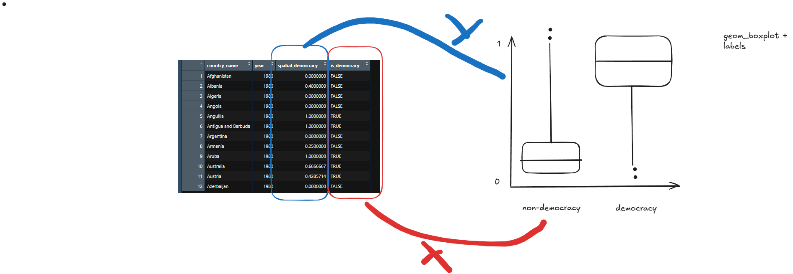
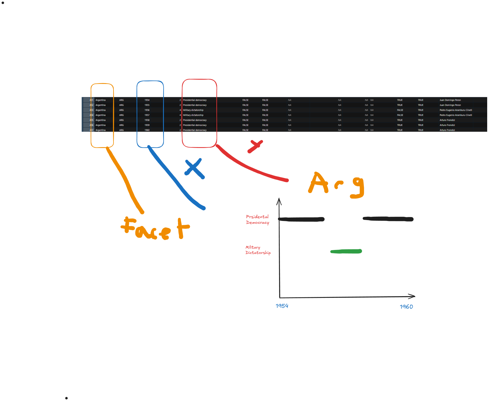

```{r}
# Data from the package {democracyData}
#install.packages("pak")
#pak::pak("xmarquez/democracyData")
library(democracyData)
library(tidyverse)

democracy_data <-
  democracyData::pacl_update |> 
  janitor::clean_names() |> 
  dplyr::select(
    "country_name" = "pacl_update_country",
    "country_code" = "pacl_update_country_isocode",
    "year",
    "regime_category_index" = "dd_regime",
    "regime_category" = "dd_category",
    "is_monarchy" = "monarchy",
    "is_commonwealth" = "commonwealth",
    "monarch_name",
    "monarch_accession_year" = "monarch_accession",
    "monarch_birthyear",
    "is_female_monarch" = "female_monarch",
    "is_democracy" = "democracy",
    "is_presidential" = "presidential",
    "president_name",
    "president_accesion_year" = "president_accesion",
    "president_birthyear",
    "is_interim_phase" = "interim_phase",
    "is_female_president" = "female_president",
    "is_colony" = "colony",
    "colony_of",
    "colony_administrated_by",
    "is_communist" = "communist",
    "has_regime_change_lag" = "regime_change_lag",
    "spatial_democracy",
    "parliament_chambers" = "no_of_chambers_in_parliament",
    "has_proportional_voting" = "proportional_voting",
    "election_system",
    "lower_house_members" = "no_of_members_in_lower_house",
    "upper_house_members" = "no_of_members_in_upper_house",
    "third_house_members" = "no_of_members_in_third_house",
    "has_new_constitution" = "new_constitution",
    "has_full_suffrage" = "fullsuffrage",
    "suffrage_restriction",
    "electoral_category_index" = "electoral",
    "spatial_electoral",
    "has_alternation" = "alternation",
    "is_multiparty" = "multiparty",
    "has_free_and_fair_election" = "free_and_fair_election",
    "parliamentary_election_year",
    "election_month" = "election_month_year",
    "has_postponed_election" = "postponed_election"
  ) |>
  dplyr::mutate(
    election_month = dplyr::na_if(.data$election_month, "?")
  ) |> 
  tidyr::separate_wider_regex(
    "election_month",
    patterns = c(
      election_month = "\\D+",
      election_year = "\\d{4}$"
    ),
    too_few = "align_start"
  ) |> 
  dplyr::mutate(
    electoral_category = dplyr::case_match(
      .data$electoral_category_index,
      0 ~ "no elections",
      1 ~ "single-party elections",
      2 ~ "non-democratic multi-party elections",
      3 ~ "democratic elections"
    ),
    .after = "electoral_category_index"
  ) |> 
  dplyr::mutate(
    election_month = stringr::str_squish(.data$election_month),
    dplyr::across(
      c(
        tidyselect::ends_with("_index"),
        tidyselect::contains("year"),
        tidyselect::ends_with("_members"),
        "parliament_chambers"
      ),
      as.integer
    ),
    dplyr::across(
      c(
        tidyselect::starts_with("is_"),
        tidyselect::starts_with("has_")
      ),
      as.logical
    )
  )
```

## Data context

This is a time series dataset which has multiple countries with varying political regimes, elections, and characteristics from 1950 to 2020 which captures political change over time. Each row represents a country in a specific year. It includes measures of democracy, dictatorship, monarchy, presidential systems, suffrage, electoral systems, party competition, and parliamentary structure. The data comes from the democracyData library and was featured on tidy Tuesday.

## Cleaning performed

-   Standardized all column names to snake case using janitor::clean_names().

-   Selected a subset of variables from pacl\_ update

-   Renamed variables to more readable names for analysis

-   Replaced ? values in the election month field with na's

-   Split the combined election month and year field into separate election_month and election_year variables

-   Removed extra whitespace from election month values

-   Created a labeled electoral_category variable from the numeric electoral_category_index

-   Converted year, index, chamber count, and member count variables to ints

-   Converted indicator variables beginning with is\_ or has\_ to logical variables

## Research questions with the data

-   How often do countries switch between democratic and non-democratic regimes over time?
-   How does spatial democracy differ between democratic and non-democratic countries?

## Research questions using supplemental data

-   Do economic indicators or inequality help explain democratic breakdowns or shifts to dicatorships?
-   Are democratic regimes associated with better quality of life such as life expectancy, education, or lower conflict?

## Drawings

Question: How does spatial democracy differ between democratic and non-democratic countries?

```{r}
example_data <- democracy_data |>
  filter(
    year == 1980,
    !is.na(spatial_democracy),
    !is.na(is_democracy)
  ) |>
  select(country_name, year, spatial_democracy, is_democracy) |>
  slice(1:12)
```



Question: How often do countries switch between democratic and non-democratic regimes over time?


