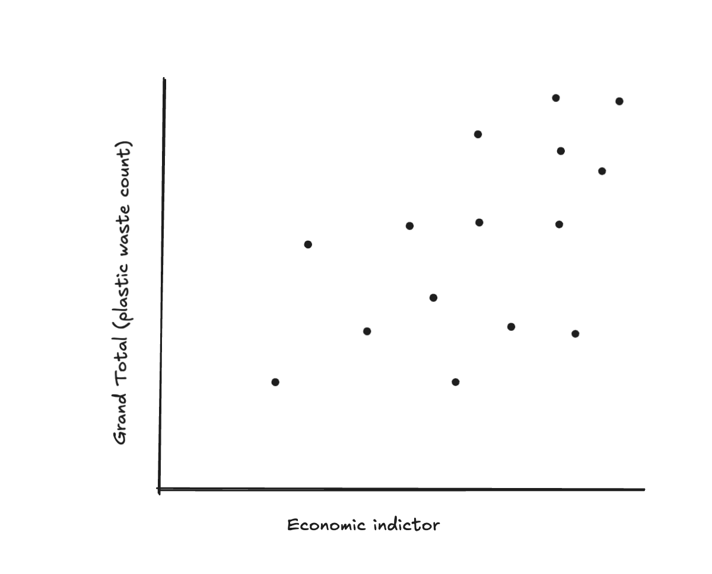
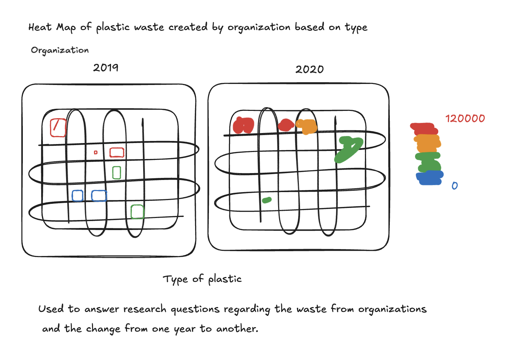

# Environmental Plastic

# Check in 1: Exploring the data and Generating Research Questions

### (used Johnathan's check in for context due to my first check in being different)

## Context of the Data

This was a data frame with information on plastic pollution. It was originally collected by the Break Free From Plastic (BFFP) group. They are an environmental activist with an interest in reducing the amount of plastic waste in the world. They focus on reducing the use of single use plastics and other actions across the entire life cycle of plastics. They believe that the best way to address plastic pollution comes from prevention over treating the effects of pollution. The data is two years (2019 and 2020) worth of data collected through global audits that BFFP does trying to understand the sources of plastic waste creation. The information provided by the data set is the country, parent company which created the plastic waste, the number of clean up events and volunteers, and the counts of plastic waste. This was unit-less so I am assuming individual plastic pieces collected at the event. There was a grand total count and multiple columns representing the different types of plastics ranging from the thin material of bags to PVC pipe plastic. Each row seems to represent a country and company combination. There are over 10,000 rows of data.

## Cleaning Already Performed on Data

This data was originally found in multiple folders one each for the years 2019 and 2020. Each folder then had a separate csv file for each country. jonthegeek used map_dfr to combine all the csv files into a single data frame. This function also changed the data types. All were turned into doubles as they were numbers except for the country and parent company as these were characters. He then added a year column as the ideas was to eventually combine the two years together. After cleaning up the names with janitor he did the same thing to the 2020 data. This one had some duplicate columns so he used an if_else function to take care of that. Finally the two years were bound together and some names were changed to make it easier to work with and we now have the data set we will be using.

## Possible Research Questions

### Assessed using the data

-   We could ask if there was a change in the generation of plastic waste from one year to another. This can be looked at both by country and by parent company. We can see in what direction progress is going by looking at this data

-   We could look at the number of counting events and volunteers across the countries. This, along with the waste information can help us look at the impact of volunteer work. Maybe the difference in plastic waste could be correlated to the amount of volunteers and events dedicated to clean up.

### Assessed using supplemental data

-   We could ask if the type of plastic being used in the country depends on how developed the country is. Maybe some plastic is cheaper to produce and used in higher proportions in countries with less money. This matters because some plastics may be more harmful to the environment and keeping track of it would be important

-   We could explore the amount of waste created by companies and see if they have environmentally friendly production practices and see if that makes a difference. This could help determine the impact that said practices and policies have on the creation of plastic pollution

## Possible Visualizations



The dot's size could also be different sizes depending on how many companies are producing plastic waste in it.



```{r, include=FALSE}
#
library(tidyverse)
library(gt)

plastics <- readr::read_csv('https://raw.githubusercontent.com/rfordatascience/tidytuesday/main/data/2021/2021-01-26/plastics.csv')

```

# Check in 2: Initial Data Manipulation Functions

```{r}
plastics |> 
  summary()

```

## Cleaning up NA Values

```{r}
plastics_clean <- plastics |> 
  mutate(across(empty:pvc, ~replace_na(., 0)),
         total = rowSums(across(c(empty:pvc))),
         .before = num_events)
```

To address the NA values present in our data our group decided to turn any NA within the plastic type columns into a zero. The rationale being that when being filled out if there were no counts of a certain type some would input a 0 and others would leave the cell empty on a spreadsheet. To address NAs in the grand totals we summed the counts of the different type of plastics and found that only two discrepancies were found shown below.

```{r}
plastics_clean|> 
  filter(grand_total != total)
```

## Summaries using unmodified columns

Two data summaries that use existing (unmodified) columns in the data At least one of these summaries need to be produced with a custom function. At least one of these summaries need to include iteration (either inside or outside of a function).

### Plastic Cleanup Profile by Country and Year (Custom Function)

```{r}


country_profile <- function(data, group_var1, group_var2, min_audits = 10) {
  data |>
    filter(!is.na(country), country != "EMPTY") |>
    group_by({{ group_var1 }}, {{ group_var2 }}) |>
    summarise(
      audits = n(),
      total_pieces = sum(total),
      median_pieces = median(total),
      mean_pieces = mean(total),
      max_pieces = max(total),
      .groups = "drop"
    ) |>
    filter(audits >= min_audits) |>
    arrange({{ group_var1 }}, {{ group_var2 }}) |>
    gt() |>
    tab_header(
      title = md(
        paste0(
          "**Table.** Plastic cleanup profile by country and year for countries with at     least ",
           min_audits,
          " audits."
        )
      )
  ) |>
  fmt_number(
    columns = c(audits, total_pieces, median_pieces, mean_pieces, max_pieces),
    decimals = 1,
    use_seps = TRUE
  ) |>
  cols_label(
    country = md("**Country**"),
    year = md("**Year**"),
    audits = md("**Audits**"),
    total_pieces = md("**Total Pieces**"),
    median_pieces = md("**Median Pieces**"),
    mean_pieces = md("**Mean Pieces**"),
    max_pieces = md("**Max Pieces**")
  )
}


country_profile(plastics_clean, country, year, min_audits = 1) 
```

### Plastic Type Across All Audits (Iteration)

```{r}
plastic_cols <- c("hdpe", "ldpe", "o", "pet", "pp", "ps", "pvc")

map_dfr(plastic_cols, function(col) {
  tibble(
    plastic_type = col,
    total = sum(plastics_clean[[col]]),
    mean = mean(plastics_clean[[col]]),
    median = median(plastics_clean[[col]]),
    sd = sd(plastics_clean[[col]]),
    iqr = IQR(plastics_clean[[col]]),
    min = min(plastics_clean[[col]]),
    max = max(plastics_clean[[col]]),
    audits_with_plastic_type = sum(plastics_clean[[col]] > 0),
    percent_of_audits = mean(plastics_clean[[col]] > 0)
  )
}) |>
  gt() |>
  fmt_percent(columns = percent_of_audits, decimals = 1) |>
  tab_style(
    style = cell_text(weight = "bold"),
    locations = cells_column_labels()
  ) |>
  tab_header("Summary statistics for each plastic type across all audits") |>
  cols_label(
    plastic_type = "Plastic Type",
    total = "Total",
    mean = "Mean",
    median = "Median",
    sd = "SD",
    iqr = "IQR",
    min = "Min",
    max = "Max",
    audits_with_plastic_type = "Audits With Plastic Type",
    percent_of_audits = "Percent of Audits"
  )

```

## Data Summaries Using Modified Columns

Two data summaries that modify columns from the original data At least one of these summaries need to be produced with a custom function. At least one of these summaries need to include iteration (either inside or outside of a function).

### Waste per Audit Summary (Custom Function)

```{r}

rate_ify <- function(df, numerator, denominator, name = rate){
  stopifnot(is.data.frame(df))
  df |>
    mutate({{name}} := {{numerator}}/{{denominator}})
}

plastics_clean |> 
  group_by(country,year) |> 
  summarise(total_trash = sum(total),
            num_events = mean(num_events),
            .groups = "drop") |>
  rate_ify(numerator = total_trash,
           denominator = num_events,
           name = avg_event_impact) |> 
  filter(country %in% c("India",
                        "China",
                        "United States of America",
                        "Indonesia", 
                        "Nigeria")) |>
 
  gt() |>
  fmt_number(columns = avg_event_impact, drop_trailing_zeros = TRUE) |> 
  tab_style(style = cell_text(weight = "bold"),
            locations = cells_column_labels()) |>
  tab_caption("Rate of Plastic Accounted per Audit for 
              Highly Populated Countries") |>
  cols_label(country = "Country", 
             year = "Year",
             total_trash = "Total Count of Plastics",
             num_events = "Number of Audit Events",
             avg_event_impact = "Average Waste Accounted for per Audit")
```

### Proportions of Plastics for each Country (Iteration)

```{r}

proportions <- function(df) {
  
  df |>
    select(country:pvc) |>
    map_if(is.numeric, ~.x / df$total) |>
    as.data.frame() 
  
}

plastics_clean |>
    mutate(year = factor(year)) |>
    group_by(country, year) |>
    summarise(across(hdpe:total, 
                     ~sum(.x, na.rm = TRUE)),
              .groups = "drop") |>
  proportions() |>
  filter(country %in% c("India", "China", "United States of America", "Indonesia", "Nigeria")) |>
  gt() |>
  fmt_percent(columns = hdpe:pvc) |>
  tab_style(style = cell_text(weight = "bold"),
    locations = cells_column_labels()) |>
  tab_caption("Percentage of each plastic type found in audits from highly populated countries by year") |>
  cols_move_to_end(o) |>
  cols_label(country = "Country", 
             year = "Year",
             hdpe = "HDPE",
             ldpe = "LDPE",
             o = "Other",
             pet = "PET",
             pp = "PP",
             ps = "PS",
             pvc = "PVC")

```
